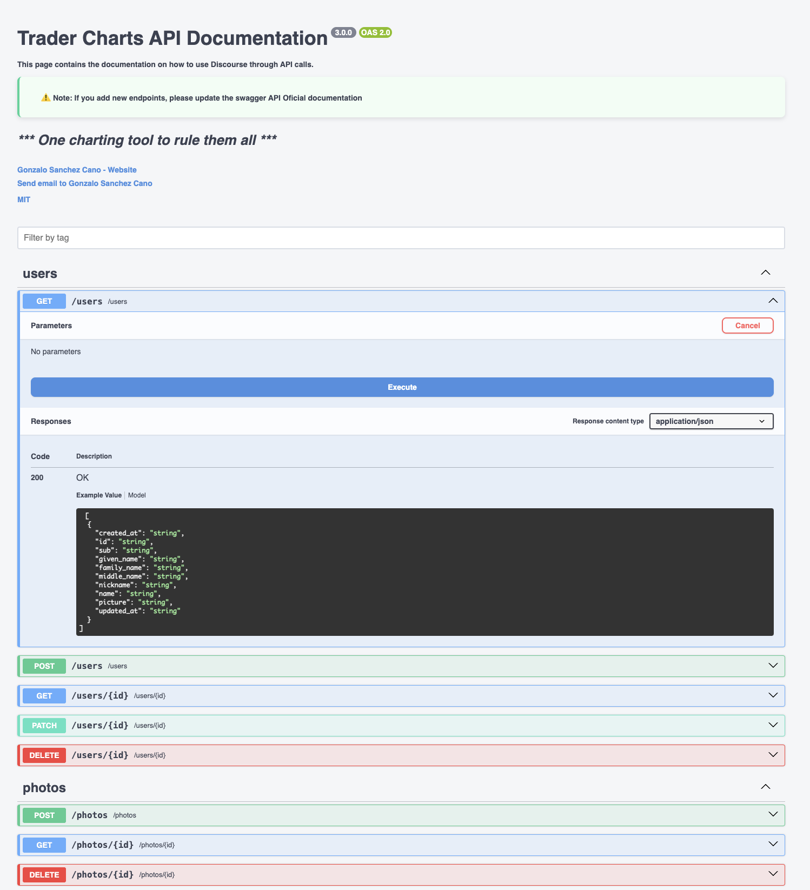
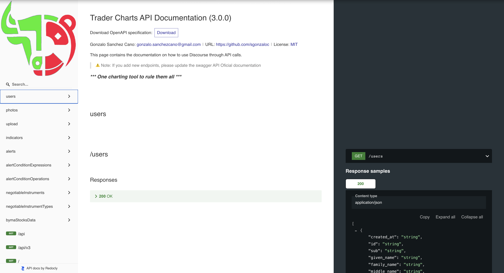

<div align="center">
    
    <h1>
       Trader Charts
    </h1>
    <h3>
        Trader Charts is a tool for performing technical analysis with interactive charts. It allows users to visualize stock data or other asset data depending on what the data providers supply, and to apply technical indicators to analyze price trends 
    </h3>
   <h5>
      * One charting tool to rule them all *
   </h5>
</div>

---


[](https://app.fossa.com/projects/git%2Bgithub.com%2FTraderCharts%2Ftrader-charts-backend?ref=badge_shield)
---

🚀 **Want to contribute?**

We welcome collaborators who wish to contribute and help enhance this trading tool. Feel free to reach out to the maintainers to get involved.

---

## Project Structure

> ⚠️ Important: Make sure you follow the existing project structure

- _/src_
  - _/adapters_: data access layer (DBs, APIs, external services)
  - _/controllers_: Express routes, organized by module
  - _/fixtures_: mock or fixture data
  - \_/managers: business logic layer — sits between controllers and adapters, handling data processing and coordination
- _/assets_: static public assets (images, CSS, client JS)
- _/config_: configuration files
- _/docs_: API and documentation files
- _/scripts_: helper or automation scripts
- _/scripts/install_: setup/installation scripts
- _/tests_: test files

### Installing project

Trader Charts Project is based on **Nodejs**, and use **Sequelize** to be able to connect to a **PostgreSQL** database.

It supports several database connections, SQL and mongodb, local and cloud databases.

1.  Install dependencies

        $ npm ci

## Roadmap 🛤️

### Included features

- [x] Adding AppRouter
- [x] Adding UploadRouter
- [x] Adding PhotoRouter
- [x] Adding UsersRouter
- [x] Adding NegotiableInstrumentTypesRouter
- [x] Adding IndicatorsRouter
- [x] Adding AlertConditionExpressionsRouter
- [x] Adding AlertConditionOperationsRouter
- [x] Adding NegotiableInstrumentsRouter
- [x] Adding BymaStocksDataRouter
- [x] Adding AlertsTargetNegotiableInstrumentsRouter
- [x] Adding API UI Endpoints
- [x] Adding API Documentation
- [x] Add SQL logger
- [x] Add Application logger
- [x] Export logs to corresponding file

## Database Connections

This project supports **SQL** and **MongoDB** databases.  
To use them, you must either install the database locally or use a cloud solution like **MongoDB Atlas** or **AWS**.  
After that, configure the required environment variables.

## Environments

There are three environments: **development**, **development with fixtures**, and **production**.

1. **Development with Mocked Database**  
   You just need to create an empty database. All tables and basic example data will be automatically installed at runtime.  
   To run the mocked database environment:

   ```
   npm run start-mock
   ```

2. **Development**  
   Database tables and structure will be created automatically. No fixture data will be inserted.  
   To run the development environment:

   ```
   npm run start-dev
   ```

3. **Production**  
   No data is set up automatically. You must create all tables and insert data manually.  
   To run the production environment:

   ```
   npm run start
   ```

## API

You can interact with the API using tools like **Postman**, or via **Trader Charts API**. We use **Swagger** for testing API endpoints and generating the API specification, and **Redoc** for a clean, readable API documentation.

### 1. Generate the API client

Before using the API, run the following command to generate the necessary Swagger API files:

```bash
npm run generate-swagger-api
```

### 2. Access the API

- **API Endpoints**
  - Access directly at [Trader Charts API](http://localhost:3002/api)

    

- **API Specifications**
  - View the [Swagger 2.0 spec](http://localhost:3002/api-spec)
  - View the [OpenAPI 3.0 spec](http://localhost:3002/api-spec/v3)

- **API Documentation**
  - Explore a clear API documentation at [Trader Charts Documentation](http://localhost:3002/docs/)

    

### Testing the API

There are three main options for testing the project:

1. Access the Trader Charts API and make API calls directly using the **"Execute"** feature in the API Endpoints.
2. Run [Postman](https://www.postman.com/downloads) or any other similar tool for making calls.
3. Run [Frontend](https://github.com/TraderCharts/trader-charts-frontend) to test the integration with the project

### 2. Update the API Documentation

> **⚠️ Important:** When adding new endpoints, make sure to update the corresponding endpoint files and verify that all previous endpoints are still available in the documentation

#### Generate Runtime Documentation

1. Run the following command to generate documentation including all new endpoints:

```
npm run generate-swagger-api
```

2. Copy the runtime files **only after verifying your endpoints locally**. This is crucial to ensure the schemas appear correctly in Redoc.

3. After testing, replace the default specification files with the runtime versions by renaming them:

- Rename `swagger_runtime.json` to `swagger_default.json` (overwrites the default file)
- Rename `swagger_runtime_v3.json` to `swagger_default_v3.json` (overwrites the default file)

## Required Env Variables

### 🧩 Common Variables

These variables are shared across all environments.

> 📝 Note: You only need to include the variables for the database you are using (SQL **or** MongoDB).

#### SQL Database (only if using SQL)

        DB_HOST=[string]
        DB_NAME=[string]
        DB_PORT=[number]
        DB_USER=[string]
        DB_PASS=[string]
        DB_SSL=true

#### MongoDB (only if using MongoDB)

        DB_DIALECT=mongodb        # Use MongoDB instead of SQL ['mongodb', 'sql]
        ATLAS_URI=[string]      # MongoDB Atlas cloud URI
        MONGODB_URI=[string]    # Local/other MongoDB URI

### 🧪 Development

Create `.env.development.local` file:

        # + include all common variables

### 🚀 Production

Create `.env.production` file:

        NODE_PATH=./src
        NODE_ENV='production'
        # + include all common variables

## Contributors ✨

Thanks goes to these wonderful people:

<table>
  <tbody>
    <tr>
      <td align="center" valign="top" width="14.28%"><a href="https://github.com/sgonzaloc"><br /><sub><b>Gonzalo</b></sub></a></td>
    </tr>
  </tbody>
</table>


## License
[](https://app.fossa.com/projects/git%2Bgithub.com%2FTraderCharts%2Ftrader-charts-backend?ref=badge_large)